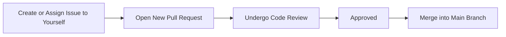

<!--
Copyright (c) 2025 by OpenTier GmbH
SPDX‑FileCopyrightText: 2025 OpenTier GmbH
SPDX‑License‑Identifier: MIT

This file is part of OpenTier.

Permission is hereby granted, free of charge, to any person obtaining a copy
of this software and associated documentation files (the "Software"), to deal
in the Software without restriction, including without limitation the rights
to use, copy, modify, merge, publish, distribute, sublicense, and/or sell
copies of the Software, and to permit persons to whom the Software is
furnished to do so, subject to the following conditions:

The above copyright notice and this permission notice shall be included in all
copies or substantial portions of the Software.

THE SOFTWARE IS PROVIDED "AS IS", WITHOUT WARRANTY OF ANY KIND, EXPRESS OR
IMPLIED, INCLUDING BUT NOT LIMITED TO THE WARRANTIES OF MERCHANTABILITY,
FITNESS FOR A PARTICULAR PURPOSE AND NONINFRINGEMENT. IN NO EVENT SHALL THE
AUTHORS OR COPYRIGHT HOLDERS BE LIABLE FOR ANY CLAIM, DAMAGES OR OTHER
LIABILITY, WHETHER IN AN ACTION OF CONTRACT, TORT OR OTHERWISE, ARISING FROM,
OUT OF OR IN CONNECTION WITH THE SOFTWARE OR THE USE OR OTHER DEALINGS IN THE
SOFTWARE.
-->

# Contributing guidelines

We’re excited to have you contribute to our project! Below are the guidelines and steps for contributing effectively.

## Pull Request Checklist

Before submitting your pull request, please ensure the following:

1. Read the [Contributing Guidelines](CONTRIBUTING.md) - Familiarize yourself with our guidelines for contributing.
2. Review the [Code of Conduct](CODE_OF_CONDUCT.md) - We expect all contributors to follow the Code of Conduct.
3. Sign the [Contributor License Agreement (CLA)]() - If this is your first contribution, please ensure that you have signed the CLA.

## How to become a contributor and submit your own code

To help guide you through the process of contributing, follow the steps below:

1. **Create or Assign an Issue**
   - Before starting work, please check if there’s an existing issue that aligns with your intended contribution
   - If an issue exists, assign it to yourself, or create a new one with a clear and detailed description of the proposed change or fix
2. **Open a New Pull Request**
   - Branch off from the main branch
   - Follow our coding standards and commit message conventions
   - Link the pull request to the relevant issue(s) and provide a descriptive summary of the changes made
3. **Undergo Code Review**
   - A team member or another contributor will review your pull request
   - Respond to feedback, make any requested adjustments, and update your pull request as necessary
4. **Approval and Merge**
   - Once approved, your pull request will be merged into the main branch by a maintainer
   - You may delete your branch after the merge is complete
