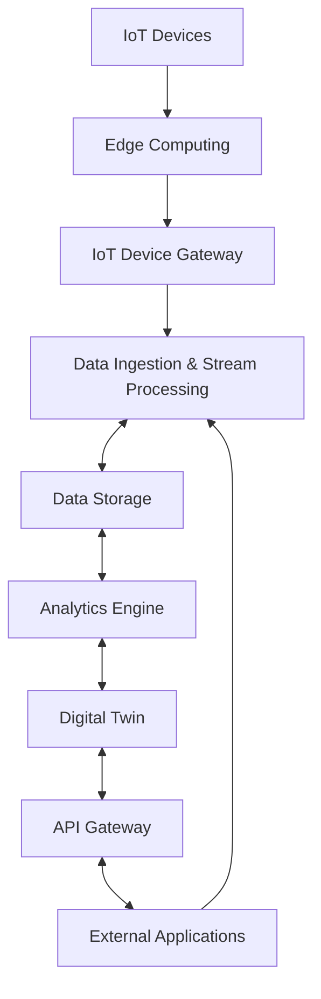

# STAIRS Platform Architecture

This document outlines the architecture and main components of the STAIRS platform (Scalable Technology for Automotive, IoT and Robotics Systems).

## Overview

STAIRS is built on a modular architecture designed for scalability, interoperability, and reliability. The platform leverages open source components to provide a comprehensive solution for automotive, IoT, and robotics systems.

## Main Components

### IoT Device Gateway
Handles communication with IoT devices using various protocols, ensuring secure and reliable connections. This component is responsible for protocol translation, device authentication, and message routing.

### API Gateway
Provides a unified entry point for all client applications, handling authentication, rate limiting, and request routing. The API Gateway manages access control and serves as the interface for external systems to interact with the platform.

### Data Ingestion & Stream Processing
Manages the collection, transformation, and real-time processing of data streams from connected devices. This component handles high-volume data flows and enables immediate analysis and action on incoming data.

### Data Storage
Implements a scalable and reliable storage solution for both time-series data and structured device information. The storage layer supports different data models optimized for various query patterns and retention policies.

### Analytics Engine
Processes collected data to derive insights, identify patterns, and generate actionable intelligence. The analytics engine supports both batch processing for historical analysis and real-time analytics for immediate insights.

### Edge Computing
Enables computation at the edge of the network to reduce latency and bandwidth usage for time-sensitive applications. Edge nodes can process data locally and synchronize with the cloud platform as needed.

### Digital Twin
Creates virtual representations of physical devices to simulate, analyze, and optimize device performance and behavior. Digital twins enable advanced monitoring, predictive maintenance, and scenario testing without affecting the physical devices.

## High-level System Architecture Diagram

## Technology Stack

The STAIRS platform is designed to be technology-agnostic, allowing for flexibility in implementation. However, the reference architecture leverages proven open source technologies for each component.

## Integration Points

The platform provides multiple integration points for extending functionality and connecting with external systems:
- REST APIs for application integration
- Message queues for event-driven communication
- SDK libraries for client application development
- Plugin architecture for custom extensions

## Deployment Models

STAIRS supports multiple deployment models:
- Cloud-native deployment on public or private clouds
- Hybrid deployment with edge components on-premises
- Containerized deployment for easy scaling and management