# STAIRS Development Roadmap

This document outlines the planned features and current development status for the STAIRS platform (Scalable Technology for Automotive, IoT and Robotics Systems).

## Roadmap Visualization

```mermaid
graph LR
    %% Current Priority
    subgraph Current Priority
        A1[Device Registration & Provisioning]
        A2[Connectivity Protocol Support]
        E2[Geolocation & Fleet Management]
    end

    %% Core Infrastructure Planned: Security and Scalability follow Connectivity
    A2 --> A3[Security & Encryption]
    A3 --> A4[Scalability & Performance]

    %% Device Operations Planned
    B1[Device Management] --> B2[Remote Firmware & Software Updates]
    B2 --> B3[Device Lifecycle Management]

    %% Data Processing Planned
    C1[Real-Time Data Ingestion & Stream Processing] --> C2[Edge Computing]
    C2 --> C3[Data Analytics & Visualization]

    %% Integration & Architecture Planned: Initiated after remote updates
    B2 --> D1[API Integration & Interoperability]
    D1 --> D2[Event-Driven Architecture]
    D2 --> D3[Integration with AI & Machine Learning]

    %% Business Logic & Compliance Planned: From analytics and geolocation to rules, privacy, and audit trails
    E2 --> E1[Customizable Rules Engine]
    E1 --> E3[Data Privacy & Regulatory Compliance]
    E3 --> E4[Logging & Audit Trails]

    %% Cross-category Dependencies
    A1 -.-> B1
    A2 -.-> C1
    B2 -.-> D1
    C3 -.-> E1

    %% Apply classes for statuses
    class A1,A2,E2 inprogress;
    class A3,A4,B1,B2,B3,C1,C2,C3,D1,D2,D3,E1,E3,E4 notstarted;

    %% Define styles for each status
    classDef inprogress fill:#42a5f5,stroke:#0d47a1,stroke-width:2px;
    classDef notstarted fill:#3f3f3f,stroke:#fefefe,stroke-width:2px;
```

## Feature

| Feature                                      | Description                                                                                                                                                                                                                                                                      |
| -------------------------------------------- | -------------------------------------------------------------------------------------------------------------------------------------------------------------------------------------------------------------------------------------------------------------------------------- |
| Device Registration & Provisioning           | Enables the seamless onboarding of devices into the platform by automating the registration process, assigning unique identities, and initializing secure configurations. This is crucial for both fixed installations and mobile/vehicle-based devices.                         |
| Device Management                            | Provides tools for remote monitoring, configuration, and control over devices. This includes status monitoring, diagnostic alerts, and remote configuration updates to maintain optimal device performance and reduce downtime.                                                  |
| Connectivity Protocol Support                | Supports multiple communication protocols (e.g., MQTT, CoAP, HTTP, AMQP) to ensure interoperability between a wide range of devices and networks, whether they are static sensors in a building or connected vehicles on the move.                                               |
| Real-Time Data Ingestion & Stream Processing | Facilitates the collection and continuous processing of high-frequency sensor data streams. This capability ensures timely insights from both fixed installations and dynamic sources like vehicles, enabling immediate response to critical events or anomalies.                |
| Edge Computing                               | Empowers localized data processing directly at the edge of the network (e.g., in vehicles or remote sensors) to reduce latency, conserve bandwidth, and deliver faster insights where necessary.                                                                                 |
| Remote Firmware & Software Updates           | Allows for Over-the-Air (OTA) updates and remote patching of device software. This is essential for maintaining security, adding new features, and correcting issues without requiring physical access to the devices.                                                           |
| Security & Encryption                        | Offers comprehensive security measures, including authentication, access control, data encryption in transit and at rest, and regular vulnerability assessments to safeguard both the devices and transmitted data.                                                              |
| Scalability & Performance                    | Ensures that the platform can handle an increasing number of devices and volume of data, with load balancing, multi-tenant support, and high availability features to meet the diverse needs of large static deployments and widespread vehicle fleets.                          |
| API Integration & Interoperability           | Provides extensive APIs and SDKs that enable integration with third-party systems, legacy applications, and other IoT ecosystems. This promotes connectivity among various platforms and simplifies the extension of functionalities.                                            |
| Data Analytics & Visualization               | Incorporates analytics tools and dashboard capabilities that aggregate device data, create visualizations, and derive actionable insights in real-time. This helps stakeholders monitor performance trends and predict maintenance needs.                                        |
| Customizable Rules Engine                    | Includes a flexible rules engine that allows users to define custom business logic, triggers, and automated workflows in response to specific sensor events or thresholds, supporting both scheduled maintenance in static setups and dynamic responses in vehicles.             |
| Event-Driven Architecture                    | Structures the platform to react to events generated by devices as they occur, enabling efficient real-time processing and integration with automation workflows, which is particularly beneficial for critical alerts in vehicular systems.                                     |
| Geolocation & Fleet Management               | Features specialized for vehicle-based IoT, such as GPS tracking, geofencing, route optimization, and remote diagnostics, to monitor and manage mobile assets effectively.                                                                                                       |
| Data Privacy & Regulatory Compliance         | Ensures that data collection, storage, and processing adhere to relevant privacy laws and industry regulations (e.g., GDPR, HIPAA), protecting sensitive information from both stationary and mobile environments.                                                               |
| Logging & Audit Trails                       | Maintains detailed logs of device events, system changes, and user actions to support compliance, security audits, and debugging, ensuring that every interaction on the platform can be traced back if necessary.                                                               |
| Device Lifecycle Management                  | Manages the full lifecycle of IoT devices—from deployment and operation through to retirement—by tracking device status, usage patterns, and maintenance requirements, which is particularly critical for long-lasting static devices and rapidly evolving vehicle technologies. |
| Integration with AI & Machine Learning       | Leverages AI/ML techniques for predictive analytics, anomaly detection, and optimizing operational efficiency. This integration supports advanced use cases like predictive maintenance for equipment or intelligent driving aids in vehicles.                                   |

## Development Timeline

The roadmap is subject to change based on community feedback and project priorities. If you're interested in contributing to any of these features, please check our [Contribution guidelines](../CONTRIBUTING.md) and join the discussion in the issues section.
